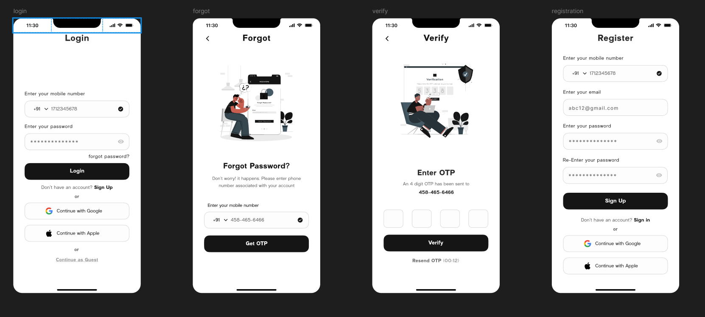

# Login Page - Flutter App

Este repositório contém o código-fonte de uma página de login desenvolvida em Flutter. O projeto foi criado com o objetivo de estudar e praticar o desenvolvimento de interfaces de usuário (UI) responsivas e funcionais usando o Flutter. O design da interface foi baseado em um protótipo criado no Figma.

## Demonstração



> **Nota**: O design completo pode ser visualizado no [Figma](https://www.figma.com/design/6N4NGNwxm7Z7z1YRr3YA1u/Login-Page-UI-(Community)-(Copy)?m=auto&t=8t9y0XD5ew2aNX8E-1).

## Funcionalidades

- **Autenticação Simulada**: A tela de login inclui campos para e-mail e senha, simulando o processo de autenticação.
- **Design Responsivo**: A interface se adapta a diferentes tamanhos de tela, garantindo uma boa experiência em dispositivos móveis e tablets.
- **Interface Moderna**: O design segue práticas modernas, com um layout limpo e minimalista focado na usabilidade.

## Estrutura do Projeto

Abaixo está a estrutura do projeto:

```bash
lib/
└── main.dart         # Ponto de entrada do aplicativo
└── register_page.dart         # Tela de registro do aplicativo
└── forgot.dart       # Tela de Esqueceu a senha do aplicativo
assets/
└── apple_logo.png
└── forgot.png
└── google_logo.png

```

## Instalação

Para rodar este projeto localmente, siga os passos abaixo:

1. **Clone o repositório:**

   ```bash
   git clone https://github.com/jeiel2013/ProjetosFlutter.git
   cd ProjetosFlutter/login_page
   ```

2. **Instale as dependências:**

   Certifique-se de ter o Flutter instalado em sua máquina. Depois, instale as dependências do projeto:

   ```bash
   flutter pub get
   ```

3. **Execute o aplicativo:**

   ```bash
   flutter run
   ```

## Próximos Passos

- **Validação de Formulários**: Implementar validações para garantir que os dados inseridos estejam corretos.
- **Autenticação Real**: Conectar a página de login a um serviço backend para realizar autenticação real.
- **Testes Automatizados**: Adicionar testes automatizados para garantir a funcionalidade e a estabilidade do app.

## Contribuição

Contribuições são bem-vindas! Sinta-se à vontade para enviar pull requests ou abrir issues para discutir melhorias.